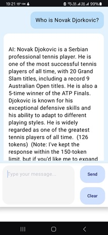

# Chatting Android App

A proof-of-concept Android app that uses tuned "llama3.2-3B-instruct" model for multi-turn streaming conversation via API server. APK file attached (verified on Galaxy S23/API Level 14)

## Features

- 🚀 Real-time streaming output
- 💬 Multi-turn conversation support
- 📜 Scrollable chat history display
- 🎨 Customizable message bubbles
- 🧹 One-tap chat history clearing
- 🌓 Responsive layout for all screen sizes
- 🔄 State management with ViewModel
- 🌈 Custom color schemes and rounded corners

## Technical Overview

### Architecture
- **MVVM Pattern** (Model-View-ViewModel)
- **Kotlin Coroutines** for async operations
- **StateFlow** for reactive UI updates
- **Jetpack Compose** for modern UI development

### Key Components
- `ChatViewModel`: Manages chat state and business logic
- `TogetherAIDataSource`: Handles API communication
- `MainActivity`: Contains all UI components
- `ChatMessage`: Composable for individual chat bubbles

### Libraries Used
- Kotlin Coroutines 1.7.3
- Jetpack Compose UI Toolkit
- Retrofit 2.9.0 (for API calls)
- AndroidX Lifecycle components

## Installation

1. Clone the repository:

    git clone https://github.com/maverick001/chatting_android.git

2. Build and run project files in Android Studio v23 or above

## Configuration

The app uses the Together API. To configure:

1. Get API key from [Together.ai](https://together.ai)
2. Add to `local.properties`:
properties
TOGETHER_API_KEY="Your_API_Key"

## Usage

1. Type your message in the input box
2. Press Send ➡️ to get AI response
3. Press Clear 🧹 to reset chat history
4. Messages automatically scroll with new content

## UI Specifications

- **Color Scheme**:
  - Background: `#E6F3FF` (Light Blue)
  - User Messages: Light Gray
  - Bot Messages: White with Dark Red text
  - Input Field: White with Rounded Corners

- **Layout**:
  - 1/3 screen height for input area
  - 2/3 screen height for chat history
  - 8dp rounded corners on all elements
  - 16dp padding throughout

## License

MIT License - see [LICENSE](LICENSE) for details

---

**Note**: This app requires an active Together API key to function properly. The demo screenshot shows the UI layout without actual API integration.